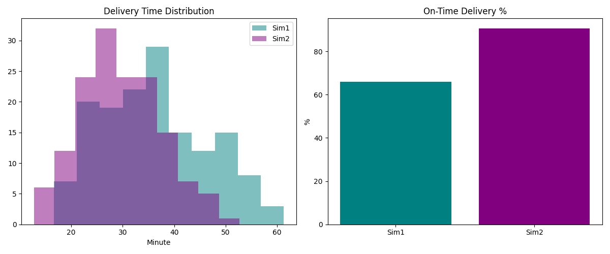

# food-delivery-simulation
Food delivery system simulation with AI routing comparison
# Food Delivery System Simulation

This project explores food delivery systems through a simulation lens, 
focusing on optimizing logistics and technology for timely and accurate deliveries.

## Overview

Two simulation scenarios were compared:
- **Baseline Model (Sim 1):** Baseline model without real-time traffic data
- **AI-Powered Model(Sim 2):** AI-powered routing with real-time traffic updates

> **Insight:** AI-powered routing significantly reduces the variance in delivery times, leading to higher customer satisfaction and more predictable fleet management.

## Key Findings

| Metric | Simulation 1 | Simulation 2 |
|--------|-------------|-------------|
| Average Delivery Time | ~35 min | ~28 min |
| On-Time Delivery | ~66% | ~90%+ |

## Results


*Figure 1: Comparative analysis of delivery performance between Simulation 1 and Simulation 2.*
## Technologies Used

- Python
- Pandas
- Matplotlib

## How to Run
```bash
python simulate.py
python compare_results.py
```
