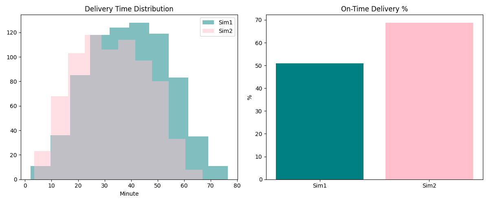
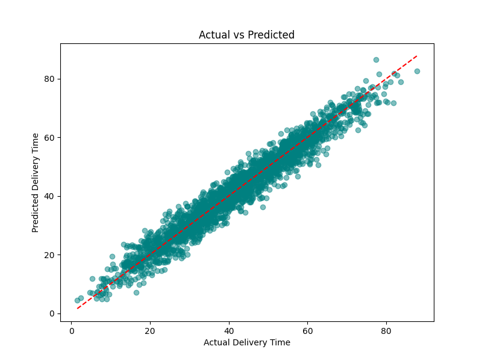
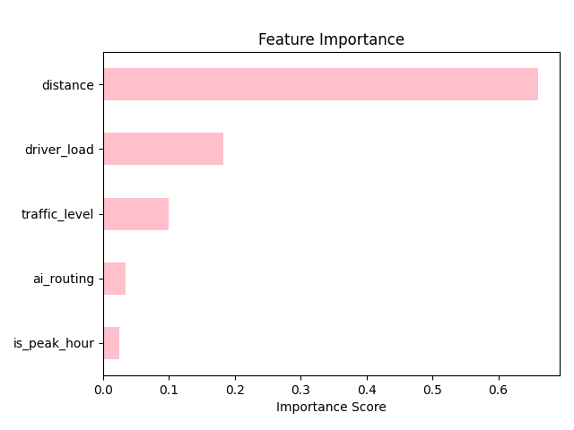
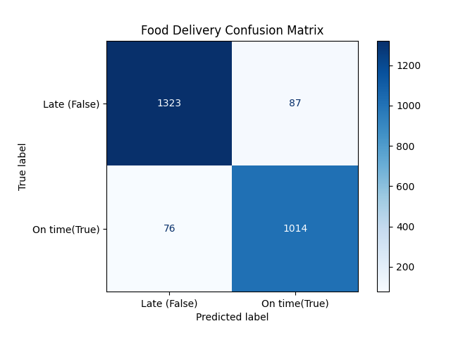

# Food Delivery System Simulation & ML Pipeline

This project simulates a food delivery system to compare a baseline routing model 
with an AI-powered routing approach — then takes it a step further by building 
machine learning models on top of the simulated data.

Real-world delivery systems rely on accurate time estimation and efficient routing.
This project demonstrates how simulation and machine learning can be combined
to model and improve such systems under realistic constraints.

## What This Project Does

Two delivery scenarios were simulated and compared:

- **Simulation 1 (Baseline):** Drivers follow standard routing without any real-time traffic awareness
- **Simulation 2 (AI Routing):** Routes are optimized based on traffic level, peak hours, and driver load

After generating the data, two ML models were trained to predict delivery outcomes:
- **Regression** → predicts how long a delivery will take
- **Classification** → predicts whether a delivery will arrive on time

## Methodology

Each simulation runs 50 drivers handling orders across different times of day. 
Delivery time is calculated based on:
- Distance (km)
- Traffic level (low / medium / high based on hour)
- Driver load (how many orders the driver is handling)
- Peak hour penalty
- Random noise to simulate real-world unpredictability

AI routing reduces traffic and peak hour penalties, reflecting smarter route selection.

Instead of using external datasets, all data was generated through a custom-built simulation environment,
allowing full control over system dynamics and feature relationships.

## Key Findings

### Simulation Results
| Metric | Simulation 1 | Simulation 2 |
|--------|-------------|-------------|
| Average Delivery Time | ~35 min | ~28 min |
| On-Time Delivery Rate | ~51% | ~69% |

### ML Results
| Model | Metric | Score |
|-------|--------|-------|
| Random Forest Regressor | MAE | 2.65 min |
| Random Forest Regressor | R² | 0.95 |
| Random Forest Classifier | Accuracy | 93% |

The most influential feature across both models was **distance**, followed by **driver load** and **traffic level**.

## Results


*Figure 1: Delivery time distribution and on-time delivery rate — Sim1 vs Sim2*



*Figure 2: Actual vs Predicted delivery times*



*Figure 3: Feature importance scores from the regression model*



*Figure 4: Classification model — on-time delivery prediction*

## Technologies Used

- Python
- Pandas
- Matplotlib
- scikit-learn

## How to Run

```bash
python 01_simulate.py          # generate simulation data
python 02_compare_results.py   # visualize simulation comparison
python 03_ml_regression.py     # train & evaluate regression model
python 04_on_time_classification.py  # train & evaluate classification model
```

## About

This project started as a university group simulation study on food delivery systems 
and evolved into a full ML pipeline. Built to practice end-to-end data science — 
from data generation to model evaluation.
